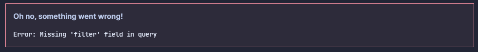

# Changelog

All notable changes to this project will be documented in this file.

The format is based on [Keep a Changelog](https://keepachangelog.com/en/1.0.0/),
and this project adheres to [Semantic Versioning](https://semver.org/spec/v2.0.0.html).

## Unreleased

### ✨ Features

- You can now use YAML for writing your Todoist queries.

## [1.10.1] - 2022-12-22

### 🐛 Bug Fixes

- Requests to Todoist's API should no longer fail CORS checks.

## [1.10.0] - 2022-10-17

### ✨ Features

- You can now press 'Enter' in the create task dialog to create the task. [Thanks to @oleeskild](https://github.com/oleeskild)
- This plugin's default styles updated to the new theme in Obsidian v1.0.

### 🔁 Changes

- The priority CSS classes now appear on the outer `div` for a given task. This should allow you to style the entire task, not just the checkbox/description.

### 🐛 Bug Fixes

- The plugin should now respect your Vault configuration directory when saving your Todoist token.

### ⚙ Internal

- This plugin now uses the Todoist REST API v2. [Thanks to @gnapse](https://github.com/gnapse)!

## [1.9.0] - 2022-01-19

### ✨ Features

- This plugin is now compatible with live preview! Please report any functionality regressions in this mode.

### [1.8.1] - 2021-08-24

### 🐛 Bug Fixes

- Token path location should no longer be incorrect on Linux machines.

## [1.8.0] - 2021-08-07

### ✨ Features

- This plugin is now compatible with Obsidian on mobile devices!
- All task lists created by this plugin now also have the `todoist-task-list` CSS class on them for easier styling.
- Added the ability to fold the projects & section groupings when using the grouped task list view.
- Added an additional sorting option `dateDescending`. This behaves the opposite of the sorting option `date`.

### 🐛 Bug Fixes

- The date picker in the 'Add task' modal works correctly with more themes.

## [1.7.1] - 2021-06-17

### 🐛 Bug Fixes

- Right-click context menu now works with the latest Obsidian version. 

## [1.7.0] - 2021-01-24

### ✨ Features

- Markdown within tasks is now rendered as part of the task. This means that bold, italics and inline code blocks are supported, as are links (both internal and external).
- Uncompletable tasks have a `disabled` checkbox, this may look different depending on your theme, but it will stop you completing these tasks accidentally.
- You can now template the number of tasks returned by the query in the query name by using `{task_count}`
  - For example, setting the name to `Tasks ({task_count})` will render as `Tasks (10)` if there are 10 tasks returned by the query.
- Right clicking on a task will now open a context menu where you can either complete the task or open it in the browser or application.

## [1.6.2] - 2021-01-13

### 🔁 Changes

- Removed built-in update checker as Obsidian has one for plugins now!

### 🐛 Bug Fixes

- Fixed an issue where queries didn't resolve on first load.

## [1.6.1] - 2021-01-06

### 🐛 Bug Fixes

- Refreshing tasks no longer causes any existing task to disappear and then reappear.
- Use `MarkdownRenderChild` correctly to prevent potential memory leaks.

## [1.6.0] - 2020-12-31

### ✨ Features

- A long awaited and requested feature is finally here! You can create Todoist tasks from within Obsidian.
  - This is accessible through a command which will open a modal for the task details.
  - There is a second command which will append the link to the current active page at the end of the Todoist task.
  - Any selected text under the cursor will be pre-filled as the task text.
  - This does _not_ support Todoist's syntax such as '#' for projects, '@' for labels, and smart date recognition.
- Improved the setup of the plugin. Now the plugin will prompt you for an API token on launch and you can set the token through the settings.
- There is now a message rendered if your query returns no tasks.
- Add default CSS for the default Obsidian theme.

### 🔁 Changes

- The 'Refresh Metadata' command no longer has a duplicate 'Todoist' identifier in front of it.

### 🐛 Bug Fixes

- JSON parsing errors are now correctly handled and displayed to the user.

### ⚙ Internal

- Refactored component injection to use the `MarkdownPostProcessor` API.

## [1.5.0] - 2020-10-31

### ✨ Features

- This plugin is now compatible with the [official Obsidian API](https://github.com/obsidianmd/obsidian-api). It was developed against Obsidian 0.9.10.

## [1.4.0] - 2020-10-19

Along with this release, I've released an Obsidian theme which has built-in support for this plugin! 🎉

Check it out at [jamiebrynes7/moonlight-obsidian-theme](https://github.com/jamiebrynes7/moonlight-obsidian-theme)!

### ✨ Features

- The version of the plugin is now displayed in the settings tab along with a link to the changelog.
- You can specify that the result of a query should be grouped by project & section. To do this, add the `"group": true` field to the JSON query.
  ```json
  {
    "name": "My Tasks",
    "filter": "today | overdue",
    "group": true
  }
  ```
- You can now check for plugin updates in the Todoist plugin settings.
- The JSON query is now validated and errors are presented in a more user-friendly fashion:
  
- Any `workspace-leaf` which has an injected query will have the `contains-todoist-query` CSS class attached. This allows you to style these leafs independently of the others.

### 🔃 Changed

- Errors are displayed more prominently in the injected Todoist query.

### ⚙ Internal

- Added the ability to turn on debug logging in the plugin.

## [1.3.1] - 2020-09-18

### 🐛 Bug Fixes

- Fixed an issue where the 'Render labels' setting did not work.

## [1.3.0] - 2020-09-17

### ✨ Features

- Tasks now render labels under them by default. This can be toggled in the settings (along with the accompanying icon).
- Tasks now render projects & section under them by default. This can be toggled in the settings (along with the accompanying icon).

  - The layout of the project, date, and label combo can be configured in CSS. For example:

    ```css
    /* To make date & project sit inline */
    .task-metadata {
      display: inline;
    }

    /* To make date & project sit on top of each other. */
    .task-metadata {
      display: block;
    }
    ```

- There is a new command `Todoist: Refresh Metadata` which will re-fetch your projects, sections, and labels. If you add/remove/rename these, you should refresh the metadata. This is done automatically at startup.
- Added `contains-task-list` to match latest Obsidian styling.
- The entire task (`li` element) has the `task-overdue` class on it, in addition to the date element specifically.
- The task (`li` element) has either `has-time` or `has-no-time` derived from the date field. (No date or time will also have `has-no-time`).
- Add support for Obsidian v0.8.14

### 🐛 Bug Fixes

- Fixed a bug where tasks with datetimes were sometimes sorted incorrectly.

## [1.2.2] - 2020-09-06

### 🐛 Bug Fixes

- Fixed an issue where the `task-overdue` status would disappear if a task above it was checked off.

## [1.2.1] - 2020-09-06

### 🐛 Bug Fixes

- Fixed an issue where subtasks would cause errors with sorting.

## [1.2.0] - 2020-09-05

### ✨ Features

- Subtasks are now nested under their parent if both are included in the filter. If a subtask is captured by a filter, but the parent is not, it will be listed as a top level item. You may need to adjust your priority CSS to accommodate these changes. For example:
  ```diff
  + .todoist-p1 > input[type="checkbox"] {
  - .todoist-p1 input[type="checkbox"] {
      /* This matches against the input element rendered for a priority 1 task. */
  }
  ```
- Tasks now render dates under them by default. This can be toggled in the settings (along with some the accompanying icon). If you choose to use icons, I recommend you _at least_ add the following CSS to your own (tweaking may be required based on your theme):
  ```css
  .task-calendar-icon {
    vertical-align: middle;
    height: 17px;
    width: 17px;
  }
  ```
- Added support for controlling the ordering of the rendered tasks. This can be done by either priority or date, or a combination of them (e.g. - sort by priority, then by date). To use this feature, amend your queries:
  ````markdown
  ```json
  {
    "name": "My Tasks",
    "filter": "today | overdue",
    "autorefresh": 30,
    "sorting": ["date", "priority"]
  }
  ```
  ````

### ⚙ Internal

- Ported the plugin to (almost entirely) Typescript.

## [1.1.0] - 2020-08-31

### ✨ Features

- Each rendered task's CSS now contains information about the task's priority. You can use this information to style each priority differently. These classes are `todoist-p1`, `todoist-p2`, `todoist-p3`, and `todoist-p4`. For example:
  ```css
  .todoist-p1 input[type="checkbox"] {
    /* This matches against the input element rendered for a priority 1 task. */
  }
  ```
- When a task is removed or added, it now transitions with a smooth fading effect, rather than immediately being added/removed. This can be turned off in the settings.
- Added support for auto-refreshing queries. This can be set at a global level within the settings tab or overridden for each individual query. For example:
  ````markdown
  ```json
  {
    "name": "My Tasks",
    "filter": "today | overdue",
    "autorefresh": 30
  }
  ```
  ````
- Added a setting tab in the Obsidian setting menu. There are three settings included in this release:
  - "Task fade animation" - controls whether to use the fade animation
  - "Auto-refresh" - controls whether all queries should auto-refresh
  - "Auto-refresh interval" - controls the default interval for auto-refreshing queries

### 🔃 Changes

- The rendered task list now uses the ordering as defined by the Todoist API.

### 🐛 Bug Fixes

- The injected Todoist query components are correctly destroyed when removed from the DOM.

## [1.0.0] - 2020-08-29

This was the initial release of the Obsidian x Todoist plugin. It contained the basic functionality for:

- materializing tasks in an Obsidian note
- allowing you to check tasks off from an Obsidian note
