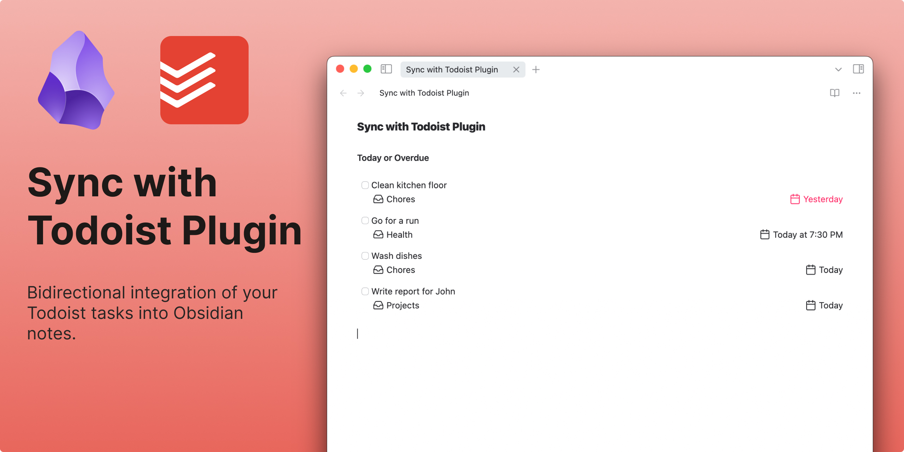

## What is it?

An **unofficial** plugin for Obsidian that offers the ability to have your Todoist tasks sync bidirectionally with Obsidian. Please note that this is not created by, affiliated with, or supported by Doist.

Please refer to the [documentation](https://jamiebrynes7.github.io/obsidian-todoist-plugin/docs/overview) for details on how to install and use this plugin.

If you like this plugin, feel free to support the development by buying a coffee:

