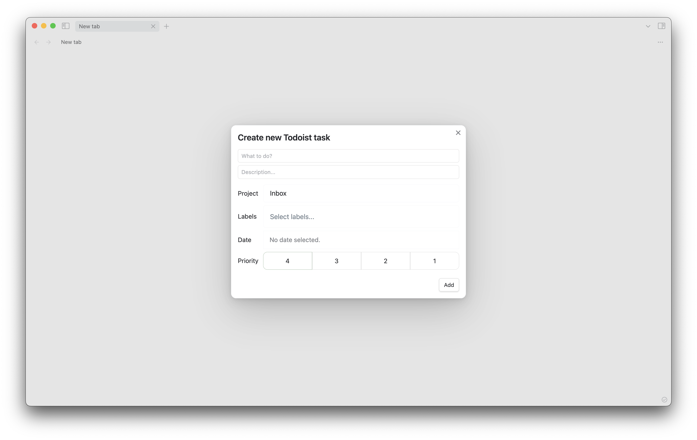

# Add Task

The 'Add Todoist task' command allows you send tasks to Todoist from Obsidian. There are a few utilities to help you set the text content:

- Any text selected will be used to pre-populate the task's text
- You can append a link to the currently selected Obsidian page to the task's text by using the 'Add Todoist task with the current page' variant of the command
