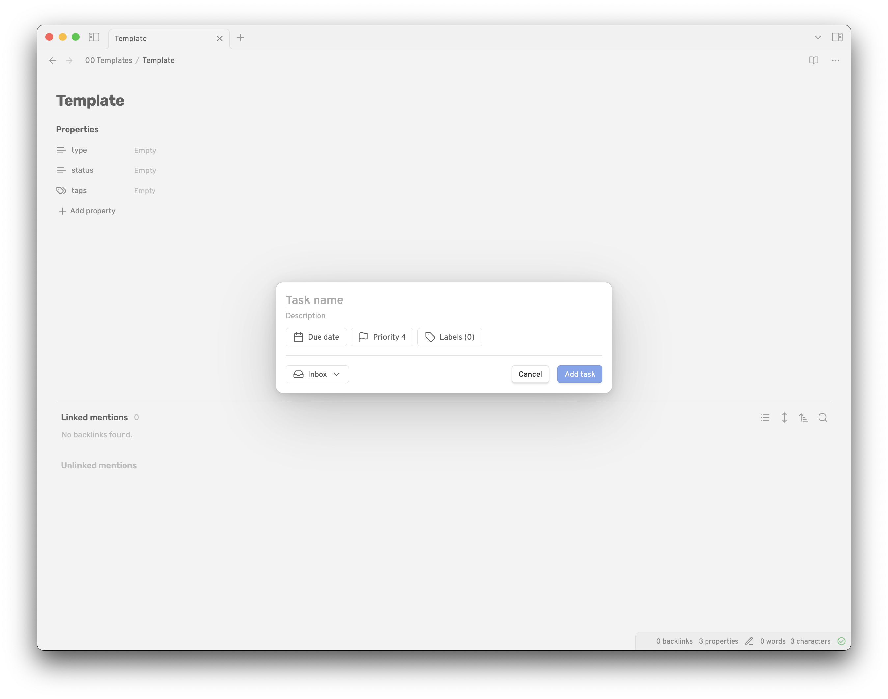

# Add task

The 'Add task' set of commands open up a modal that allows you to configure and send tasks to Todoist from Obsidian. Any text selected will be used to pre-populate the task content.

There are a few variants of the command:

- 'Add task', the basic version
- 'Add task with current page in task content', this option will append a link to the current page in the task content before it sends it to Obsidian. The modal will inform you it will do this, but the link is not shown to keep the modal clean.
- 'Add task with current page in task description', this option will append a link to the current page in the task description before it sends it to Obsidian. The modal will inform you it will do this, but the link is not shown to keep the modal clean.
